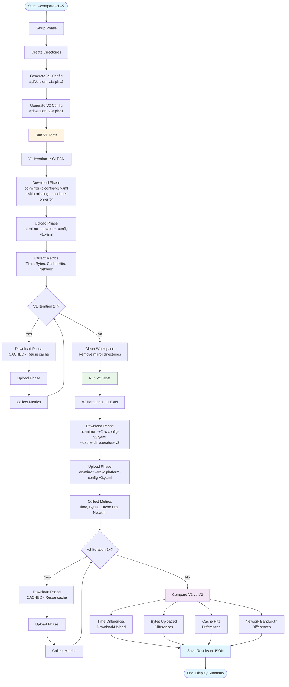

# OC Mirror Test Automation

A comprehensive Go-based test automation tool for testing [oc-mirror](https://docs.redhat.com/en/documentation/openshift_container_platform/4.18/html/disconnected_environments/about-installing-oc-mirror-v2) with detailed metrics collection, supporting both v1 and v2 comparison, clean vs cached workspace analysis, and network utilization monitoring.

## Features

- **Automated Test Execution**: Runs multiple iterations of oc-mirror download and upload phases
- **V1 vs V2 Comparison**: Compare performance between oc-mirror v1 and v2 using the same imageset configuration
- **Clean vs Cached Analysis**: Automatically compares first full mirror run with subsequent incremental updates
- **Comprehensive Metrics Collection**:
  - Real wall time (total elapsed time for download and upload phases)
  - Bytes uploaded to registry (parsed from oc-mirror logs)
  - oc-mirror verbose/debug logs to detect cache hits and skipped images
  - Network utilization (bandwidth monitoring via sysfs/proc)
- **Structured Output**: Well-formatted console output with detailed comparisons
- **JSON Results Export**: Saves detailed results to JSON files for further analysis
- **Dynamic Registry URL**: Accepts registry URL as command-line argument

## Project Structure

```
NGC-495/
├── cmd/
│   └── oc-mirror-test/      # Main application entry point
├── pkg/
│   ├── runner/               # Test runner orchestration
│   ├── command/              # oc-mirror command wrapper
│   └── monitor/              # Network monitoring
├── internal/
│   └── config/               # Configuration file generation
├── bin/                      # Built binaries (generated)
├── results/                  # Test results JSON files (generated)
├── Makefile                  # Build and test automation
├── go.mod                    # Go module definition
├── README.md                 # This file
├── CONTRIBUTING.md           # Contribution guidelines
└── LICENSE                   # License file
```

## Prerequisites

- **Go 1.21+**: Required for building and running the tool
- **oc-mirror CLI**: Must be installed and available in PATH. [oc-mirror CLI](https://mirror.openshift.com/pub/openshift-v4/clients/ocp/4.20.4/oc-mirror.tar.gz) can be download from reference link.
- **Linux System**: Required for network monitoring (uses sysfs/proc)
- **Sufficient Disk Space**: For mirror operations and cache storage
- **Network Access**: To registry.redhat.io and target registry

## Installation

### Build from Source

```bash
# Clone the repository
git clone <repository-url>
cd NGC-495

# Install dependencies
make install

# Build the binary
make build

# The binary will be in ./bin/oc-mirror-test
```

### Quick Start

```bash
# Build
make build

# Run with registry URL
./bin/oc-mirror-test --registry docker://infra.5g-deployment.lab:8443/ngc-495/
```

## Usage

### Basic Usage

```bash
./bin/oc-mirror-test --registry <registry-url> [flags]
```

### Command-Line Flags

- `--registry` / `-r`: **Required**. Registry URL for upload (e.g., `docker://infra.5g-deployment.lab:8443/ngc-495/`)
- `--iterations` / `-i`: Number of iterations to run (default: 2, minimum: 2 for clean vs cached comparison)
- `--compare-v1-v2`: Enable v1 vs v2 comparison mode

### Examples

#### Standard Test (V2 Only)

```bash
./bin/oc-mirror-test \
  --registry docker://infra.5g-deployment.lab:8443/ngc-495/ \
  --iterations 3
```

#### V1 vs V2 Comparison

```bash
./bin/oc-mirror-test \
  --registry docker://infra.5g-deployment.lab:8443/ngc-495/ \
  --compare-v1-v2 \
  --iterations 2
```

## How It Works

### Standard Test Flow

1. **Setup Phase**:
   - Creates necessary directories (`oc-mirror-clone`, `mirror/operators`, `platform/mirror`, `operators` cache)
   - Generates `imageset-config-4.19.yaml` with specified operator packages

2. **Iteration Execution** (for each iteration):
   - **Clean Run (Iteration 1)**:
     - Cleans workspace directories
     - Runs download phase: `oc-mirror --v2 -c <config> file://mirror/operators --cache-dir operators`
     - Copies mirror to platform directory
     - Runs upload phase: `oc-mirror --v2 -c <config> --from file://platform/mirror <registry-url>`
   
   - **Cached Runs (Iteration 2+)**:
     - Reuses cache directory from previous runs
     - Runs same phases to demonstrate cache benefits

3. **Metrics Collection**:
   - **Time**: Measures wall-clock time for download and upload phases
   - **Bytes**: Parses oc-mirror logs to extract bytes uploaded
   - **Cache Hits**: Counts cache-related log messages
   - **Skipped Images**: Detects images skipped due to cache
   - **Network**: Monitors network interface statistics for bandwidth usage

4. **Results Comparison**:
   - Compares clean run vs cached runs
   - Calculates improvement percentages
   - Displays summary statistics

5. **Results Export**:
   - Saves detailed results to `results/results_<timestamp>.json`

### V1 vs V2 Comparison Flow

When `--compare-v1-v2` is enabled:



**Workflow Steps:**

1. **Setup Phase**: Creates directories and generates version-specific configuration files (v1alpha2 for v1, v2alpha1 for v2)
2. **V1 Test Execution**: Runs all iterations with oc-mirror v1 (without `--v2` flag)
   - Iteration 1: Clean run (no cache)
   - Iterations 2+: Cached runs (reuses cache)
   - Each iteration includes download and upload phases with metrics collection
3. **Workspace Cleanup**: Cleans mirror directories before v2 tests
4. **V2 Test Execution**: Runs all iterations with oc-mirror v2 (with `--v2` flag)
   - Iteration 1: Clean run (no cache)
   - Iterations 2+: Cached runs (reuses cache)
   - Each iteration includes download and upload phases with metrics collection
5. **Comparison**: Compares v1 vs v2 results:
   - Download/upload time differences
   - Cache hit differences
   - Network bandwidth differences
   - Bytes uploaded differences
6. **Results Export**: Saves detailed comparison results to JSON file

## ImageSet Configuration

The tool uses a predefined `imagesetconfiguration_operators.yaml` configuration with the following operators:

- **local-storage-operator** (4.19.0-202510142112)
- **odf-operator** (4.19.6-rhodf)
- **odf-dependencies** (4.19.6-rhodf)
- **cephcsi-operator** (4.19.6-rhodf)
- **mcg-operator** (4.19.6-rhodf)
- **ocs-client-operator** (4.19.6-rhodf)
- **ocs-operator** (4.19.6-rhodf)
- **odf-csi-addons-operator** (4.19.6-rhodf)
- **odf-prometheus-operator** (4.19.6-rhodf)
- **odf-external-snapshotter-operator** (4.19.6-rhodf)
- **rook-ceph-operator** (4.19.6-rhodf)
- **recipe** (4.19.6-rhodf)
- **cluster-logging** (6.3.1)
- **loki-operator** (6.3.1)

> [!NOTE]
> The tool aims to enhance the UX on accepting a `/path/to/imagesetconfiguration_operators.yaml` file and perform the validation on the coresponding content.

## Output Format

The tool provides structured output:

### Console Output

- Real-time progress indicators
- Formatted iteration summaries with box-drawing characters
- Detailed comparison tables
- Metrics breakdown by phase

### JSON Results

Results are saved to `results/results_<timestamp>.json` with:
- Per-iteration metrics
- Phase-level details (download/upload)
- Network metrics
- Cache statistics
- Comparison data

## Development

### Building

```bash
# Build binary
make build

# Build with custom version
VERSION=1.0.0 make build
```

### Testing

```bash
# Run tests
make test

# Run tests with coverage
make test
# Coverage report: coverage.html
```

### Code Quality

```bash
# Format code
make fmt

# Run go vet
make vet

# Run linter (if installed)
make lint

# Run all checks
make all
```

### Project Structure

- `cmd/oc-mirror-test/`: Main application entry point
- `pkg/runner/`: Test orchestration and result comparison
- `pkg/command/`: oc-mirror command execution wrapper
- `pkg/monitor/`: Network interface monitoring
- `internal/config/`: Configuration file generation

## Troubleshooting

### Network Monitoring Issues

If network monitoring fails, the tool will continue with a warning. Ensure:
- Running on Linux with sysfs/proc available
- Network interface is accessible
- Sufficient permissions to read network statistics

### Cache Not Working

Ensure:
- Cache directory persists between iterations
- oc-mirror v2 is properly installed
- Sufficient disk space for cache

### Registry Upload Fails

Verify:
- Registry URL is correct and accessible
- Authentication credentials are configured (if required)
- Network connectivity to registry
- Registry supports the required protocols

### V1 vs V2 Comparison Issues

- Ensure both v1 and v2 versions of oc-mirror are available
- Check that v1 doesn't require `--v2` flag
- Verify cache directories are separate for v1 and v2

## Contributing

Please see [CONTRIBUTING.md](CONTRIBUTING.md) for details on our code of conduct and the process for submitting pull requests.

## License

This project is licensed under the Apache License 2.0 - see the [LICENSE](LICENSE) file for details.

## Authors

- midu@redhat.com

## Acknowledgments

- Red Hat OpenShift team for oc-mirror tool
- OpenShift community for feedback and contributions
